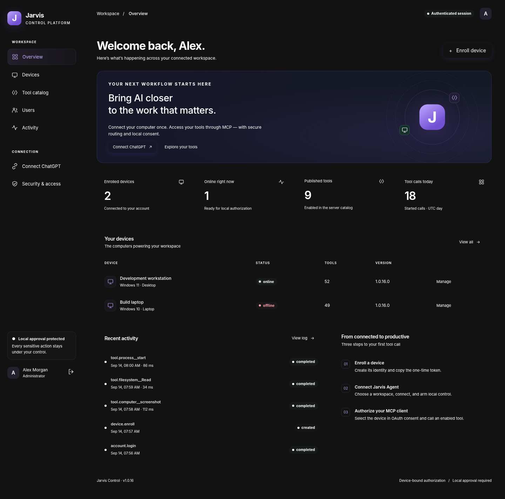
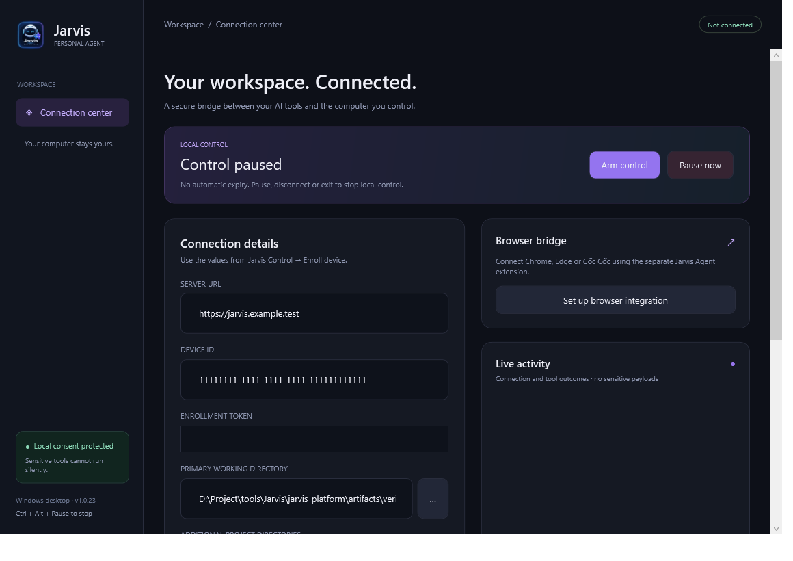

# Jarvis Control - 1.0.74

**Version 1.0.74 binds browser resource leases to the lifetime of the call that acquired them, so cancelling/stopping an old browser session promptly releases its browser/desktop claim instead of leaving a new Chrome session queued behind a stale call.** The Agent keeps the existing flat MCP browser tool IDs as compatibility proxies, `jarvis-browser-service.exe` owns browser/session execution, and `jarvis-browser-host.exe` is the Chrome/Edge native-messaging relay. Localhost work routes to an isolated dev browser profile; external browser work routes to connected Chrome/Edge. Autonomous frontend tasks collect rendered evidence themselves and fail closed when the target/browser/evidence is unavailable. See [architecture](docs/ARCHITECTURE.md), [Task Gateway](docs/AGENT-TASK-GATEWAY.md), and [BUILD-STATUS.md](docs/BUILD-STATUS.md). Build/push does not itself update a running agent or production MCP service.

A chat may call `session__open` when it needs explicit per-chat workspace/mailbox isolation, but ordinary filesystem/Git/shell/process/computer/browser/task calls no longer require `_jarvis.sessionHandle`. When no handle is present, the gateway creates an ephemeral call ID and the agent uses a stable owner/device isolation scope for stateful local resources. `session__stop_work` is resumable; destructive `session__close` is hidden from normal model discovery and retained for explicit operator/UI cleanup. Upgrade server and agent together and refresh cached MCP schemas; browser extension **1.3.0** adds protocol/capability negotiation required by the dedicated browser service.

Jarvis Control là control plane cho MCP; Jarvis Agent là ứng dụng C# .NET 10 trên Windows 10/11, gồm WPF desktop và CLI. Tên web được chọn vì yêu cầu ban đầu chưa điền tên. Một repository chứa hai project sản phẩm và shared protocol; giữ nguyên các thư mục `shared` và `vendor` khi mở solution con.

```text
ChatGPT / MCP client
  │ HTTPS · MCP Streamable HTTP · OAuth + PKCE S256
  ▼
jarvis-mcp-server  ── Jarvis Control web UI
  │ WSS · outbound connection initiated by the agent
  ▼
Jarvis Agent · Windows user session
  ├─ Local control lease / explicit consent / emergency pause
  ├─ Baseline computer-use, browser, visualize, filesystem, Git
  └─ Owned process jobs for build/test with bounded logs
```

## Mở source

Mở `Jarvis.slnx` bằng Visual Studio 2026 với .NET 10 SDK và workload **.NET desktop development**, **ASP.NET and web development**. Solution con: `jarvis-agent/Jarvis Agent.slnx`, `jarvis-mcp-server/jarvis-mcp-server.slnx`. Windows target là x64, không phải Windows Service; desktop phải có session tương tác của người dùng.

```powershell
# Chạy kiểm thử C# và xuất bản server + agent trên máy Windows có SDK/dependencies.
.\scripts\Build.ps1 -Component All -ServerRuntime linux-arm64

# OCI x86_64 dùng linux-x64; xác định kiến trúc VM trước, không đoán.
.\scripts\Build.ps1 -Component Server -ServerRuntime linux-x64

# Chỉ GUI + CLI.
.\scripts\Build.ps1 -Component Agent
```

Script sẽ restore package theo các version đã pin nếu chưa có cache. `-NoRestore` chỉ dùng sau một lần restore phù hợp cùng RID. Gói không chứa NuGet cache; không có lệnh Maven. `-SkipTests` tồn tại để điều tra lỗi build nhưng **không** dùng làm bằng chứng kiểm thử. Chưa có lockfile transitive được tạo bởi SDK.

Build thành công sẽ tạo `artifacts/agent/1.0.74/desktop/Jarvis.Agent.Desktop.exe`, `artifacts/agent/1.0.74/cli/jarvis-agent.exe`, ZIP agent và tar.gz self-contained server. Mỗi output Agent còn có `jarvis-browser-service.exe` ở publish root để dùng chung self-contained runtime/dependencies với Agent, còn native-messaging host tối thiểu nằm tại `browser/jarvis-browser-host.exe`; giữ cả thư mục publish, không copy riêng executable. WebView2 Runtime vẫn là điều kiện riêng cho visualize WPF.

## Chạy local

```powershell
.\scripts\Run-Server.Dev.ps1 -AdminEmail 'admin@example.test'
```

Script hỏi mật khẩu an toàn, không có admin mặc định. Mở `http://localhost:18765`. Development dùng ephemeral OAuth keys: restart sẽ làm mất hiệu lực các grant cũ. Không expose chế độ này ra Internet.

Đăng nhập admin → user/device/tools được quản lý trên web. User mới đăng ký ở trạng thái **pending**; admin phải approve trước khi đăng nhập. Trong **Devices**, enroll thiết bị và lưu token một lần. Mở Jarvis Agent, nhập URL/device ID/token, chọn workspace, bật tùy chọn HTTP loopback **chỉ khi test local**, rồi Connect. Kết nối thành công chưa cho phép điều khiển: cần **Arm control** (until Pause, Disconnect or Exit) tại máy. Pause qua GUI/tray hoặc `Ctrl+Alt+Pause`.

Trong **Tool permissions**, Full permission vẫn áp dụng cho các tool thông thường. Riêng `process.start` và `process.spawn` là constrained exceptions: hộp thoại local có `Deny`, `Approve once` và `Always approve`. `Always approve` được lưu vĩnh viễn theo exact tool ID trên máy đó và có thể thu hồi bằng **Require approval again**; Arm/Pause và các boundary Windows hiện có vẫn áp dụng.

Sau khi agent gửi manifest, admin vào **Tool catalog → Import installed**, kiểm tra rồi bật tool cần thiết. Tool mới import mặc định tắt. Catalog CRUD quản lý alias/metadata/availability của tool đã cài trên agent; **không upload script tùy ý để chạy trên máy người dùng**.

CLI:

```powershell
.\artifacts\agent\1.0.74\cli\jarvis-agent.exe configure
.\artifacts\agent\1.0.74\cli\jarvis-agent.exe list-tools
.\artifacts\agent\1.0.74\cli\jarvis-agent.exe doctor --json
.\artifacts\agent\1.0.74\cli\jarvis-agent.exe connect
.\artifacts\agent\1.0.74\cli\jarvis-agent.exe browser-install
```

`configure` hỏi token trên stdin ẩn; không nhận token qua URL/command line. `connect` cần terminal tương tác và xác nhận local. Không tự khởi động cùng Windows, không tự arm sau reconnect, không yêu cầu admin. GUI và CLI dùng một single-instance mutex theo Windows user.

## Kết nối ChatGPT

Production endpoint: `https://<your-domain>/mcp`. Đăng ký kết nối MCP với OAuth trong client được cấp quyền. Cấu hình **đúng callback URL mà client cung cấp** vào `Jarvis:OAuthRedirectUris`; không dùng wildcard. Discovery/DCR/code+PKCE/refresh được triển khai bằng OpenIddict. Consent chọn một device thuộc user hiện tại. Gói này chưa được thử trong một phiên ChatGPT thực.

Hướng dẫn chi tiết: [OAuth & MCP](docs/OAUTH-MCP.md), [agent](docs/AGENT.md), [API](docs/API.md), [OCI deployment](docs/DEPLOYMENT-OCI.md).

## Cấu trúc và tài liệu

| Thư mục | Trách nhiệm |
|---|---|
| `jarvis-mcp-server/src/Jarvis.McpServer` | ASP.NET Core, Identity, OAuth, MCP adapter, routing, CRUD, web assets |
| `jarvis-agent/src/Jarvis.Agent.Core` | Connection lifecycle, policy, process jobs; không phụ thuộc WPF |
| `jarvis-agent/src/Jarvis.Agent.Windows` | Adapter tới tool baseline, browser proxy/service protocol, profile DPAPI |
| `jarvis-agent/src/Jarvis.Agent.BrowserService` | Dedicated browser runtime, family routing, session/tab ownership và isolated dev browser |
| `jarvis-agent/src/Jarvis.Agent.BrowserHost` | Minimal Chrome/Edge native-messaging relay process |
| `jarvis-agent/src/Jarvis.Agent.Desktop` | WPF MVVM, tray, local prompts, WebView2 artifacts |
| `jarvis-agent/src/Jarvis.Agent.Cli` | Interactive terminal host và browser-install command |
| `shared/Jarvis.Protocol` | Envelope, bounded transport, schema validation, workspace guard |
| `vendor/jarvis-code` | Source baseline được cung cấp, dùng qua ProjectReference |
| `tests`, `.github/workflows` | C# test source/CI và kiểm thử UI với API giả lập |
| `deploy`, `scripts` | Build, private configuration, read-only preflight, isolated deployment |

Đọc [architecture](docs/ARCHITECTURE.md), [security boundaries](docs/SECURITY.md), [tool parity](docs/TOOL-PARITY.md), [test status](docs/BUILD-STATUS.md), [manual acceptance](docs/ACCEPTANCE.md), [changelog](CHANGELOG.md).

## UI preview

The web screenshot uses real web assets with synthetic API fixtures. The Agent screenshot is a real WPF render of the published 1.0.23 assembly using synthetic UI values; the smoke test did not save a profile, connect or arm remote control.




## Giới hạn quan trọng

Đây là deployment **một server instance**, broker WebSocket trong RAM + SQLite WAL. Không tuyên bố HA, exactly-once, resumable jobs qua restart, production-ready hay nhanh nhất trong benchmark. Call mất kết nối có thể đã tạo side effect; không tự replay. Một call ngắn tối đa 120 giây mặc định; build/test dài dùng `process__start/read/cancel`. Debug qua command/log/UI đã có đường triển khai; **chưa có DAP/breakpoint API chuyên dụng**.

Source tool computer/browser/visualize được giữ lại; host áp dụng giới hạn mới để dùng từ xa. HTML visualize chạy local không network, không `sendPrompt`, không inline MCP Apps trong ChatGPT. 114 optional third-party font binaries không được phân phối lại; system font dùng cho UI. Tham khảo manifest parity thay vì coi ZIP là bản sao bit-for-bit của toàn bộ archive đầu vào.

## Export và commit

```powershell
python .\scripts\Export-Source.py
```

Current package **1.0.74**, assembly/file **1.0.74.0**. Historical release notes and commit messages remain in `CHANGELOG.md`; `scripts/Verify-CurrentVersion.py` checks current-version metadata for drift.

## Agent Harness (1.0.47)

Architecture:

Goal -> Planner -> Executor -> Tool Router -> MCP Tools -> Artifact -> Verification -> Recovery -> Memory

Core remains framework independent and integrations are provided by adapters.

Packaging supports win-x64 runtime assets for Agent delivery.

## Task Gateway (1.0.48)

The MCP server routes durable tasks to the local agent over the existing authenticated WebSocket. HTTP lifecycle APIs and six device-bound MCP task tools support goal creation, explicit plan submission, status, paged output artifacts, cancellation and installed-tool schema discovery. Goal-only NORMAL/READ_ONLY input still returns `NEEDS_PLAN`; goal-only `AUTONOMOUS` input can be planned locally only when the host explicitly injects an `IRemoteTaskAgenticCoordinator`, so no model provider or extra permission is silently assumed.

Agent execution reuses local permissions, waits for process exit codes, retains bounded output and stores snapshots outside the repository. Reconnect/restart does not replay uncertain actions. Both the server and agent need this release for task-v1; older agents still support ordinary tools. Detailed usage and boundaries: [Task Gateway](docs/AGENT-TASK-GATEWAY.md). Build with `.\scripts\Build.ps1 -Component All -ServerRuntime linux-arm64 -Offline` when dependencies and runtime packs are cached. Executed release evidence is recorded in [Build status](docs/BUILD-STATUS.md).

## Dynamic Tool Host (1.0.49)

The Agent now owns a `DynamicToolRegistry` instead of freezing the installed-tool dictionary inside `AgentConnection`. Each snapshot has a generation and canonical SHA-256 descriptor digest, with local JSON schemas compiled as part of the same immutable snapshot. Ordinary calls and task-plan validation both resolve that current snapshot; discovery still cannot grant permission or bypass local approval.

Wire calls may carry optional `threadId` and `turnId` correlation, and local runtime components can subscribe to interrupt/stop/subagent-stop lifecycle notifications for deterministic cleanup. Existing clients remain compatible because the new correlation fields are optional.

## Stateful Computer Use (1.0.50)

`computer.screenshot` and the new `computer.get_state` mint an opaque state ID scoped to the current remote session. `computer.computer_batch` requires that current ID, validates it before dispatch, removes Jarvis state metadata before the reused baseline tool sees the request, and invalidates the token once dispatch starts. Take a new screenshot/state observation before the next input batch.

`computer.get_state` reports bounded foreground-window/process metadata, the focused UI Automation element and up to 200 accessibility nodes. UI Automation failures yield a partial snapshot rather than an elevation attempt. Pause/disconnect-owned cleanup invalidates outstanding computer state; existing computer app grants and denied-app rules remain in force.

## Adaptive Harness (1.0.51)

Agent Core now includes `AdaptiveAgentExecutionLoop` with validated dependency DAGs, async execution/verification and bounded replacement of only the failed logical action. Verified predecessors are not replayed by the adaptive loop. `AgentConnection` can optionally inject an `IRemoteTaskAdaptiveCoordinator`; Task Gateway uses it only for `AUTONOMOUS` tasks and never after cancellation/timeout.

The default hosts still do not silently configure a paid/model planner; NORMAL/READ_ONLY plans retain the 1.0.48 deterministic semantics. Every adaptive or agentic replacement is revalidated against the installed local tool schema and then traverses the same Arm/Pause, exact-permission and approval path.

## Goal-Owned Coding Harness (1.0.67)

`IRemoteTaskAgenticCoordinator` extends the adaptive coordinator with initial planning and final goal verification. A goal-only `AUTONOMOUS` task is queued only when this coordinator is explicitly present; its generated plan is persisted before execution, must retain goal/mode/timeout/project, and is validated against normal stage/schema/tool limits. Successful tool exit codes no longer imply autonomous completion: the coordinator receives bounded execution evidence and must pass goal verification. It may request up to two bounded repair rounds, which are appended to the persisted plan and executed through the same guarded path.

`CodingPromptAssembler` provides deterministic prompt layers for injected coordinators: coding policy, rendered frontend/browser policy, resolved workspace, sorted tool capability metadata, optional skill instructions, execution outcomes and verification debt. Prompt material is bounded, vendor-neutral and never acts as a permission grant or a model-provider configuration.

## Rendered Frontend Verification (1.0.68)

Autonomous frontend completion now fails closed through `FrontendVerificationGate`. `FrontendChangeClassifier` recognizes common rendered source extensions (`.tsx`, `.jsx`, `.vue`, `.svelte`, `.css`, `.scss`, `.sass`, `.less`, `.html`) plus frontend/visual intent in the goal. Base rendered proof requires target identity, rendered DOM/accessibility state, no framework overlay, console health, a screenshot and a target interaction with post-state evidence. Visual/layout work additionally requires desktop and mobile viewport checks plus overflow/clipping evidence.

Evidence is typed, the latest evidence for a kind wins, and missing/failing kinds are projected back into the agentic prompt as `verification-debt` before another goal-repair round. `RemoteTaskSnapshot.verification` exposes the requirement type, pass state, retained evidence, missing kinds and failed kinds; the MCP output schema advertises this field as optional so deterministic/legacy task JSON remains compatible.

## Progressive Coding Skills and Browser State (1.0.69)

`PluginSkillLoader` turns validated plugin skill roots into bounded coding context without executing plugin entry files. Discovery reads only bounded front matter metadata, rejects reparse-point traversal and paths outside declared roots, isolates oversized/invalid skills as diagnostics, and exposes compact `plugin/name: description` metadata to agentic planning/verification. Full UTF-8 Markdown instructions are loaded only through explicit `LoadSelectedSkills(...)` selection and are revalidated against the current enabled plugin catalog at load time.

Each per-session browser suite now owns a `BrowserObservationTracker`. Element refs produced by `browser.read_page` or `browser.find` belong to the current observation generation. Material navigation, form input, clicks/typing/scrolling, JavaScript, uploads, tab/browser switches and viewport resize invalidate that generation. A later ref-bearing call must use a ref from a fresh observation; stale refs fail locally before the raw Chrome tool runs. Failed mutations do not invalidate the prior generation.

## Cancelled Browser Resource Reclamation (1.0.74)

Browser resource leases now follow the cancellation lifetime of the call that acquired them. When a prior chat/session is stopped or its browser call is cancelled, the call-owned browser/desktop lease is released promptly even if the browser task has not finished unwinding. Because Chrome mutations claim both a session-scoped `browser|...` resource and shared `desktop`, this prevents an old Chrome call from blocking the first browser action in a newer session. The fail-safe is browser-only; filesystem, shell and process resource lifetimes are unchanged.

## Browser Native Host Reconnect Hardening (1.0.73)

The dedicated native-messaging relay now treats either side closing as terminal. In particular, if `jarvis-browser-service.exe` restarts while Chrome is otherwise idle, `jarvis-browser-host.exe` no longer remains blocked forever waiting for the next Chrome stdin frame. The host exits promptly, Chrome observes the native-port disconnect, and extension 1.3.0 follows its existing reconnect backoff to attach to the replacement service. This prevents a stale host from leaving `browser.list_connected_browsers` empty after an Agent/browser-service restart.

## Browser Runtime Isolation and Deterministic FE Verification (1.0.71)

Browser automation is now a process boundary rather than an in-process `BrowserBridge`. Existing `browser.*` MCP IDs remain stable in `ToolInventory`, but their Windows adapters proxy versioned requests to `jarvis-browser-service.exe`; browser-native stdio is handled only by the small `jarvis-browser-host.exe`. The service owns browser connections, application-session/tab state, observation state and per-family execution. Published Desktop and CLI packages keep the service in the publish root so it shares the validated Agent runtime/dependencies, while the independently self-contained native host lives under `browser/`. Desktop Browser integration now registers that packaged host automatically; dev outputs without it prompt specifically for `jarvis-browser-host.exe`.

`browserFamily` accepts `auto`, `dev`, `chrome`, `edge` or `extension`. `auto` routes loopback URLs to `dev`, which starts Chrome/Edge with a Jarvis-owned isolated profile and the packaged extension, while non-loopback calls select a ready external browser. The extension 1.3.0 handshake advertises browser/native-host protocol versions, capabilities and a persistent extension instance ID; incompatible extensions stay non-ready instead of receiving calls.

For `AUTONOMOUS` frontend work, completion no longer depends on the model remembering to test. Core locates the rendered loopback target and gathers target identity, rendered DOM, framework-overlay health, console health, screenshot and post-interaction state; visual work also checks 1440×900, 390×844, horizontal overflow and structural visual fidelity. The normal `FrontendVerificationGate` runs even when no `IRemoteTaskAgenticCoordinator` is configured. Missing browser/target/evidence fails closed. Explicit Figma/pixel-perfect/reference-image goals still require semantic comparison evidence rather than being auto-passed by the structural baseline.

## Visual Fidelity and Coding Quality Benchmarks (1.0.70)

Visual/layout tasks now require `FrontendEvidenceKind.VisualFidelity` in addition to desktop/mobile/overflow proof. `VisualFidelityLedger` is immutable and bounded to 128 entries across layout, typography, color, iconography, overflow and interaction-state categories. Blocking mismatches remain visible until explicitly resolved; the goal verifier can return the ledger directly and the host converts it into typed evidence so unresolved mismatches enter normal verification debt and block `COMPLETED`.

`CodingHarnessScenarios.All` defines six stable engineering fixtures: modal repair, responsive clipping, API error state, stale loading state, visual regression and backend regression. Each run records `EngineeringEvidence` for build/tests/browser/console/interaction/visual proof, corrective loops and evidence count. `HarnessEvaluator.EvaluateEngineering(...)` reports success and per-evidence pass rates plus average repair/evidence cost while the original throughput/authorization metrics remain unchanged.

## Restricted Tool Code Mode and Plugins (1.0.52)

`tool_program.run` executes only a small JSON instruction language (`call`, `set`, `if`, bounded `forEach`, `assert`, `return`). It has no `eval`, reflection, direct filesystem/network API or shell primitive. Each nested `call` is sent back through `AgentConnection`'s guarded invoker and is independently checked for local installation/schema/Arm/Pause/permission/approval. The outer composite tool is still mutating/sensitive for task-policy purposes and recursive invocation is rejected.

The plugin SDK is metadata-first: local `*.plugin.json` manifests declare an ID/version/minimum agent version, a relative entry file plus SHA-256 pin, tool IDs, permissions/skills and supported lifecycle hook names. Jarvis validates these fields and binds declared tools only to implementations already supplied by the local host; it does not load or download code from a manifest. `ApplyPluginCatalog` hot-projects that validated set into the dynamic registry without replacing non-plugin tools.

## Delegation and Durable Memory (1.0.53)

`agent_task_create` accepts optional `parentTaskId`. The local Agent verifies that the parent exists for the same owner/device, forces the child onto the same resolved project, prevents execution-mode broadening, caps lineage depth at 3 and direct children at 8, then persists `parentTaskId`, `rootTaskId` and `depth` in the normal durable task snapshot. Top-level create digests are unchanged, so pre-1.0.53 idempotent retries remain compatible.

`SqliteMemoryStore` is now genuinely durable. It stores memories in SQLite partitions keyed by owner/project/namespace, retains provenance and timestamps, supports TTL expiration and bounded text search, and keeps the legacy `IAgentMemory.Save/Get(string)` facade mapped to a default partition. SQLite connections are short-lived/non-pooled and use WAL/busy-timeout semantics for concurrent writers.

## Safe Script Code Mode and Harness V2 (1.0.60)

`tool_script.run` is a fresh-engine Jint JavaScript sandbox for control-flow-heavy tool composition. It exposes standard ECMAScript plus one host capability, `invokeTool(toolId, argsJson)`. CLR interop is not enabled and Node/process/filesystem/network globals are not injected. Script size, statements, memory, wall time, nested tool calls, argument JSON and output are bounded; a failed or denied nested tool call fails the whole script even if script code tries to catch it. Every nested effect re-enters the same installed-schema, Arm/Pause, permission and local-approval path as `tool_program.run`.

`AdaptiveAgentExecutionLoop` can now run independent ready actions concurrently only when the live registry marks their tool read-only and non-sensitive, with a configurable cap of 1..8. Mutating/sensitive actions and repair attempts remain serialized. `AgentCoreHostTools` is the single descriptor source used by the live connection, CLI `list-tools` and Desktop permissions surface, preventing host-tool catalog drift.

Harness V2 expands the deterministic offline evaluation to production runtime bootstrap, Process V2, durable threads, plugin lifecycle, protocol/doctor, Safe Script, read-only DAG parallelism and existing no-replay/state/permission scenarios. Its machine-readable schema includes targeted-test throughput and p95 scenario duration; `HarnessEvaluator` also accepts bounded real tool-latency samples and reports p50/p95/max without granting authority.

## Managed Plugin + Hook Runtime (1.0.59)

Plugin manifests remain metadata-only: Jarvis never loads or downloads the pinned entry file as arbitrary executable code. Tools and lifecycle hooks must be implementations already supplied by the local host. Manifests now support minimum/maximum Agent compatibility, validated relative skill roots, bounded MCP dependency declarations and provenance metadata in addition to the existing SHA-256 entry pin.

`PluginRuntimeBootstrap` watches the local plugin directory with debounced reload, validates a complete next catalog before publishing it and retains the previous snapshot when validation fails. Live changes flow through the dynamic catalog protocol. `interrupt`, `stop` and `subagentStop` hooks bind to explicit host implementations and failures are isolated per plugin. Local package install/update writes entry+manifest atomically with rollback on validation failure; uninstall removes only the manifest and leaves payload cleanup explicit. Doctor reports only manifest/tool/skill/MCP counts and status, not local skill paths or provenance contents.

## Durable Thread Runtime (1.0.58)

The production Agent now persists a profile-local `thread-runtime.db` and publishes seven `thread.*` tools for project-scoped orchestration. A thread records append-only events for turns, typed items, artifact references, metadata, queue mutations and fork lineage; queue rows are materialized only for efficient reorder/start operations.

`thread.checkpoint` compact/rollback operations are deliberately non-destructive. Compaction stores a summary plus an event watermark used by the default timeline projection, and rollback records a target event without deleting later audit history. `thread.get` can request compacted history explicitly; `thread.search` is bounded and restricted to selected project roots. The CLI/Desktop tool catalog and production runtime use the same store/tool descriptors.

## Process Runtime V2 (1.0.57)

`process.spawn` starts an owned executable from an argv array without inserting a shell. It supports a bounded working directory, up to 128 environment overrides, timeout, optional Windows ConPTY dimensions and returns the same opaque owned `jobId` used by `process.read/cancel`. `process.write_stdin` streams bounded UTF-8 input and `process.resize_pty` resizes only a running owned ConPTY session.

`process.read` remains cursor-based and backward compatible through its combined `output` field, and now also returns bounded structured `events` tagged `stdout`, `stderr`, `pty` or `system`. Windows PTY creation starts the child suspended, attaches it to the Agent's kill-on-close Job Object, then resumes it; Pause, permission revocation, disconnect and Agent disposal stop owned activity rather than attaching to unrelated machine processes. Task Gateway treats both `process.start` and `process.spawn` as long-running owned jobs and waits for a final exit code.

## Capability Protocol V2 and Doctor (1.0.56)

The JSON wire envelope remains version 1 for backward compatibility, while `AgentHello` and `welcome` now negotiate **protocol v2** capabilities. Current capability names cover Task Gateway v1, live catalog synchronization and scoped capability leases. A legacy peer that omits protocol metadata is normalized to protocol 1 and continues to use ordinary tool calls unchanged.

`jarvis-agent doctor --json` creates a read-only, redacted operational snapshot: package/assembly drift, negotiated protocol/capabilities, catalog generation/digest/tool count, plugin metadata health, permission-store health plus grant/lease counts, bounded task-snapshot integrity/count, owned-process count, and computer/browser readiness. It never serializes enrollment tokens, raw workspace/plugin/task paths, permission tool IDs, lease IDs/session IDs, tool arguments/results or plugin manifest content.

## Runtime Closure and Scoped Permissions (1.0.55)

Production `AgentRuntime` now constructs a single `DynamicToolRegistry`, injects a conservative default `IRemoteTaskAdaptiveCoordinator`, loads SHA-256-pinned local plugin manifests through `PluginRuntimeBootstrap`, and projects their locally supplied tools before connecting. This closes the 1.0.51/1.0.52 gap where adaptive/plugin engines existed in Core/tests but the shipping Windows composition root did not activate them.

Registry replacements now emit `catalog.changed`; the server validates and persists the new descriptor set, acknowledges it with `catalog.ack`, and pins later calls to the acknowledged catalog generation/digest. The Agent rejects calls carrying stale catalog identity before schema/tool execution. Discovery still does not grant permission.

`ToolPermissionPolicy` now supports bounded session/turn capability leases. `process.start` and structured `process.spawn` cannot use a legacy unconstrained saved Full Permission by themselves: invocation-time authority must match the session/turn, expiry, allowed workspace root and command prefix. Spawn prefixes are matched token-by-token against argv rather than reconstructed shell text. Lease expiry/revocation raises the existing cancellation signal so in-flight and queued guarded work is stopped without disarming the user's process-local Arm choice.

## Developer Tools and Evaluation (1.0.54)

Agent Core now publishes `developer.symbol_search` and `developer.test` alongside `tool_program.run`. Symbol search is read-only, workspace-scoped and bounded; test execution is intentionally marked mutating+sensitive because `dotnet test` may build/write project artifacts, so it still requires the ordinary local policy path. The DAP launcher is a Core contract rather than a remotely exposed attach/injection tool: it starts one validated adapter executable, owns that process and can stop only that owned process.

Run `powershell -ExecutionPolicy Bypass -File scripts/Run-HarnessEvaluation.ps1` to execute Harness V2. It runs named regression groups against the real Core/Windows/Server test projects, including shipping runtime bootstrap rather than Core seams alone, and writes schema-v2 JSON with targeted-test totals, throughput and p95 scenario duration to `artifacts/evaluation/harness-eval.json`. This benchmark is deterministic and requires no model/API credentials.

